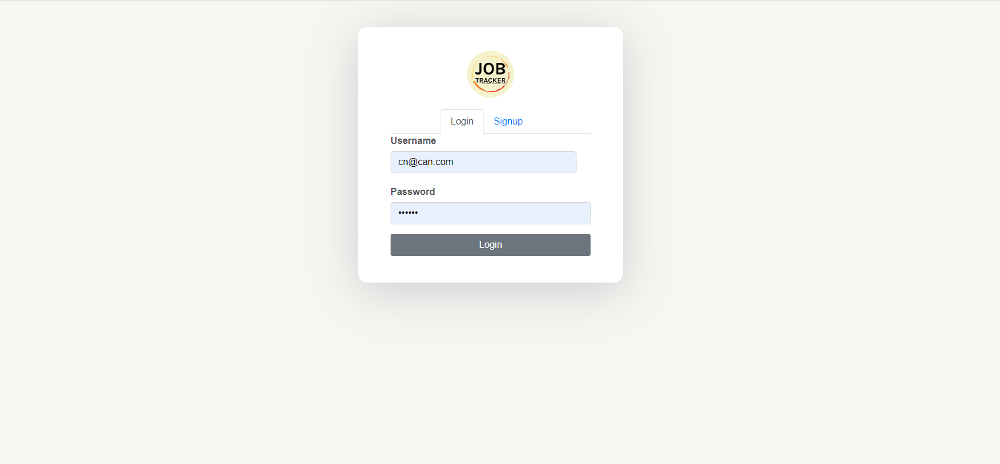
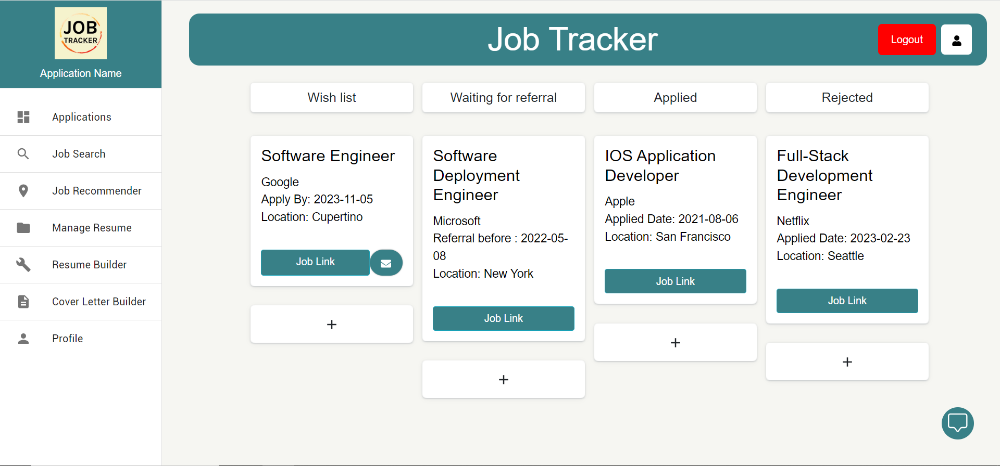
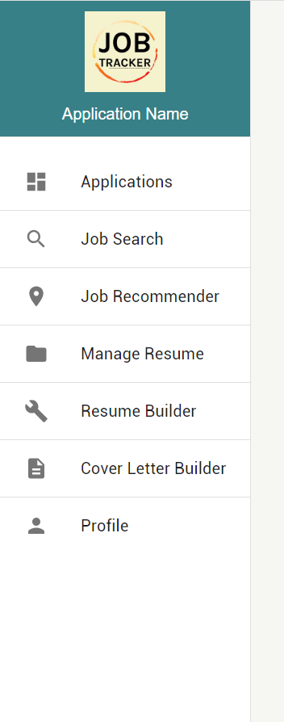
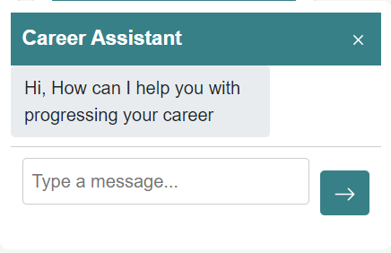
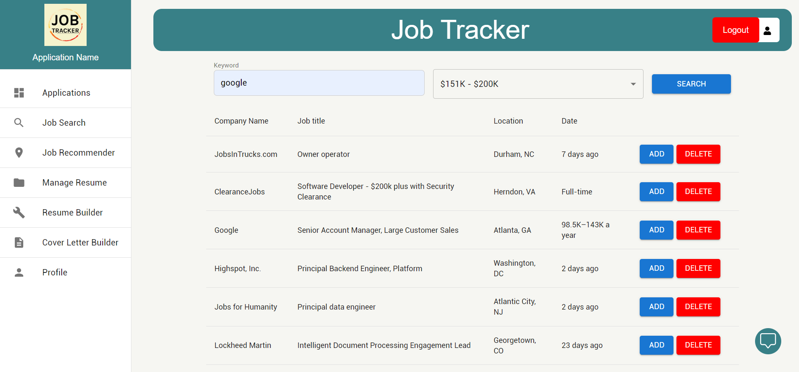
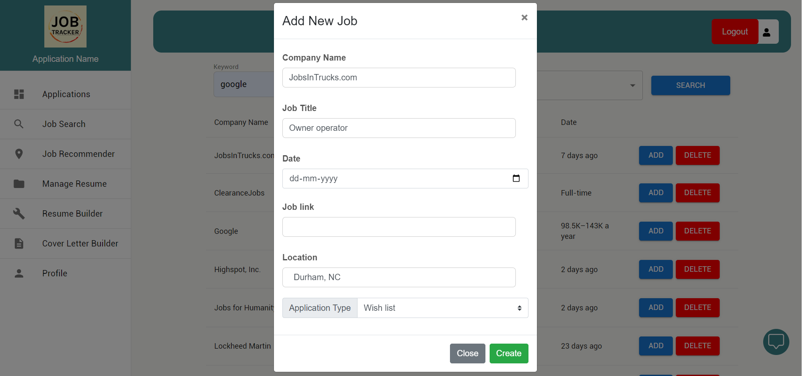

https://user-images.githubusercontent.com/89501363/144725439-5d9191f8-df13-4814-aa15-99cd752ab0cc.mp4

[](https://github.com/Shubham-Saboo/JTracker/blob/main/LICENSE)
[](https://zenodo.org/doi/10.5281/zenodo.10211927)


[](https://GitHub.com/Shubham-Saboo/JTracker/)
[](https://GitHub.com/Shubham-Saboo/JTracker/)
[](https://GitHub.com/Shubham-Saboo/JTracker/)
[](https://GitHub.com/Shubham-Saboo/JTracker/)
[](https://gitHub.com/Shubham-Saboo/JTracker)
[](https://codecov.io/gh/Shubham-Saboo/JTracker)
[](https://github.com/Shubham-Saboo/JTracker/actions/workflows/syntax_checker.yml)
[](https://github.com/Shubham-Saboo/JTracker/actions/workflows/style_checker.yml)

# Job-Tracker - Your Job Tracking Assistant

https://user-images.githubusercontent.com/43064854/135554150-c06afd4e-d223-47e3-b123-b45f9cd1b87a.mp4

The process of applying for jobs and internships is not a cakewalk. Managing job applications is a time-consuming process. Due to the referrals and deadlines, the entire procedure can be stressful. Our application allows you to track and manage your job application process, as well as regulate it, without the use of cumbersome Excel spreadsheets.

Our application keeps track of the jobs you've added to your wish list. It also keeps track of the companies you've already applied to and keeps a list of any rejections. Rather than having the user browse each company's site for potential prospects, our application allows the applicant to search for them directly using basic keywords. Any prospective work offers can then be added to the applicant's wishlist.

## Table of contents

- [Job-Tracker - Your Job Tracking Assistant](#j-tracker---your-job-tracking-assistant)
  - [Table of contents](#table-of-contents)
  - [Basic Design:](#basic-design)
  - [Samples:](#samples)
    - [Login Page / Signup Page](#login-page--signup-page)
    - [HomeScreen](#homescreen)
    - [SearchPage](#searchpage)
    - [SearchPage with Salary filter](#searchpage-with-salary-filter)
    - [ResumePage](#resumepage)
    - [Recommendations Page](#recommendations-page)
    - [Resume Builder](#resume-builder)
    - [Cover Letter Generator](#cover-letter-generator)
    - [Whats New](#whats-new)
      - [Version 2.0.0](#version-200)
      - [Version 2.0.1](#version-201)
      - [Version 2.1.0](#version-211)
  - [Future Scope:](#future-scope)
  - [Technologies Used:](#technologies-used)
  - [Installation:](#installation)
    - [Requirements:](#requirements)
    - [Strongly Recommended:](#strongly-recommended)
  - [Getting Started:](#getting-started)
    - [Boot:](#boot)
    - [Shutdown:](#shutdown)
  - [Hosting the Database:](#hosting-the-database)
    - [Local MongoDB:](#local-mongodb)
    - [Hosted database with MongoDB Atlas:](#hosted-database-with-mongodb-atlas)
  - [License](#license)
  - [How to Contribute?](#how-to-contribute)
  - [Team Members (Group 53)](#team-members-group-53)

## Basic Design:


## Samples:

### Login Page / Signup Page

The introductory visual interface displayed from which a user is able to register and log into the application.

<p align="center"></p>

### HomeScreen

The introductory visual interface displayed from which a user is able to access different cards - Waitlisted applications, Waiting for Refereals, Applied Jobs, Application Status.The user can also add cards through this screen.

<p align="center"></p>

### Side Bar

<p align="center"></p>

### Chat Box

<p align="center"></p>

### Job search Page

The interface through which a user is able to search for specific jobs and add them to Waitlisted Applications.

1. Navigate to Job search page, search for particular Job.
2. Click on Add button. Fill in the Details.
3. Click on Create buttop.
4. The application will then be saved as per the selected category.

<p align="center"></p>
<p align="center"></p>

### SearchPage with Salary filter

The interface through which a user is able to search for specific jobs based on the salary range selected.

1. Navigate to Job search page, search for particular Job and select the salary range from the dropdown.
2. Click on Search button.

<p align="center"></p>

### ResumePage

1. Navigate to resume Section
2. Upload any resume file with .PDF extension by selecting the file from local storage. Click Upload.
3. Click on download button to Download the uploaded file.

<p align="center"></p>

### Resume Builder

<p align="center"></p>
<p align="center"></p>
<p align="center"></p>

### Recommendations Page

1. Assuming that you have uploaded your resume on the resume page
2. Click on the get recommendations button
3. View the recommended companies returned by ChatGPT API

<p align="center"></p>

### Resume Builder

1. Navigate to the Resume Builder page from the Sidebar
2. Fill in your details and click the submit button
3. Download the resume generated as a doc file

<p align="center"></p>

### Cover Letter Generator

1. Fill in the Role, Company and the skills that you want to highlight in your cover letter
2. OpenAI API generates a cover letter which is returned as a doc file
3. Click on the download button to download your cover letter

<p align="center"></p>
### Whats New

#### Version 2.0.0

- Major bug fixes for the job search feature
- Implemented an interactive ChatBot to solve user queries
- Added a new feature to build a resume in a word file from user input
- Used the OpenAI API to generate the cover letter for a specific company and Job Role

#### Version 2.0.1

- Enhanced the UI of the application with major upgrades
- Added a Set Reminder function for wishlist applications
- Modified the SideBar and the Navigation Bar
- Updated badges for repo

#### Version 2.1.1

- Minor Bug Fixes
- Updated GitHub workflows files
- Added test cases

<<<<<<< Updated upstream
<<<<<<< Updated upstream
=======
=======

> > > > > > > Stashed changes

## Roadmap:


> > > > > > > Stashed changes

## Future Scope:

- Add a feature that allows users to attach the wishlist reminders to their Google calendar.
- Incorporate notifications for upcoming deadlines.
- Add a storage option for resumes and cover letters so they can be saved for future use.
- Include a direct link to the company's application site when the wishlist item is clicked.
- Include a link to the university’s career fair page.
- Direct connection to LinkedIn, allowing for the addition of job opportunities to the wishlist.
- Improve keyword search to improve specifications such as pay range, employment location, and so on.
- An option to maintain separate profiles for job tracking.

## Technologies Used:

- Python
- Node.js
- Flask
- MongoDB
- React

## Installation:

### Requirements:

- [Python](https://www.python.org/downloads/) (recommended >= 3.8)
- [pip](https://pip.pypa.io/en/stable/installation/) (Latest version 21.3 used as of 11/3)
- [npm](https://nodejs.org/en/) (Latest version 6.14.4 used as of 11/3)

### Strongly Recommended:

- A terminal environment capable of handling bash scripts.

To install all required packages, while within the context of project root directory, run:

```
./setup.sh
```

This will handle all npm and pip package installations required for both the front and backend.

_If the script says "command not found" or something similar, run chmod +x ./setup.sh. This grants the script execution privileges. Depending on your setup, this may occur for the boot_dockerless files, amongst others. The same command will fix the issue._

## Getting Started:

### Boot:

To run a testing environment, run:

```
./startup.sh
```

This will run flask and npm simultaneously, booting both the front and backend. Note - npm takes substantially longer to boot compared to flask.

### Shutdown:

To ensure that flask is no longer occupying a port, run:

```
./shutdown.sh
```

This will search for any active process containing "flask" and kill the process.

## Hosting the Database:

### Local MongoDB:

1. Download [MongoDB Community Server](https://docs.mongodb.com/manual/administration/install-community/)
2. Follow the [Installion Guide](https://docs.mongodb.com/guides/server/install/)
3. In `app.py` set `'host'` string to `'localhost'`
4. Run the local database:

```
mongod
```

- Recommended: Use a GUI such as [Studio 3T](https://studio3t.com/download/) to more easily interact with the database

### Hosted database with MongoDB Atlas:

1. [Create account](https://account.mongodb.com/account/register) for MongoDB

\*\* **_If current MongoDB Atlas owner adds your username/password to the cluster, skip to step 4_** \*\*

2. Follow MongoDB Atlas [Setup Guide](https://docs.atlas.mongodb.com/getting-started/) to create a database collection for hosting applications
3. In `app.py` set `'host'` string to your MongoDB Atlas connection string
4. Create an `application.yml` file in the /backend directory with the specifications:

```
username: <MongoDB Atlas cluster username>
password: <MongoDB Atlas cluster password>
```

5. For testing through CI to function as expected, repository secrets will need to be added through the settings. Create individual secrets with the following keys/values:

```
MONGO_USER: <MongoDB Atlas cluster username>
MONGO_PASS: <MongoDB Atlas cluster password>
```

## License

The project is licensed under the [MIT](https://choosealicense.com/licenses/mit/) license.

## How to Contribute?

Please see our CONTRIBUTING.md for instructions on how to contribute to the repository and assist us in improving the project.

## Team Members (Group 53)

<center>
  <table>
    <tr>
        <td align="center"><br /><sub><b>Left to Right -  <a href="https://github.com/nayaksyndrome">Chinmay Nayak</a>,  <a href="https://github.com/Shubham-Saboo">Shubham Saboo</a>, <a href="https://github.com/RajatChandak2000">  Rajat Chandak</a>,  <a href="https://github.com/VibhavDeo">Vibhav Deo</a></b></sub><br /></td>
    </tr>
  </table>
</center>
